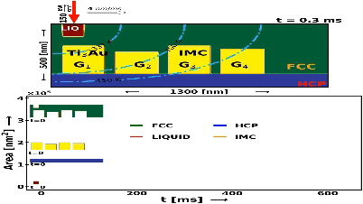

## Simulation Result Animations

### Tempeature Distribution | Irradiance: 150 kW/cm2; Scan Speed: 4nm/ms

### Phase Evolution | Irradiance: 150 kW/cm2; Scan Speed: 4nm/ms

### Isotherm | Irradiance: 150 kW/cm2; Scan Speed: 4nm/ms

### Phase Area Growth | Irradiance: 150 kW/cm2; Scan Speed: 4nm/ms
